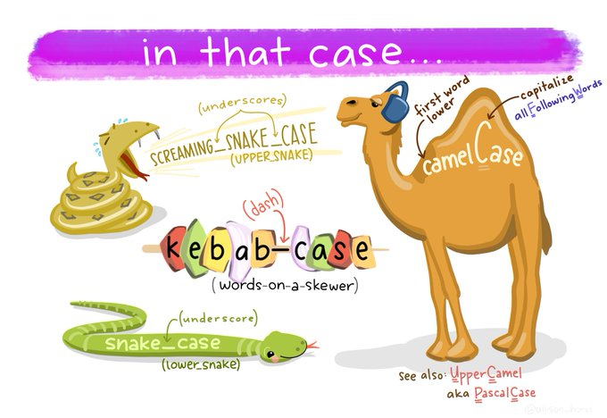

変数について解説しましたが、下記のような質問をいただきましたので、回答します！

質問：box_countというように「アンダースコア」を使用していますが、boxCountやBoxCountなどもあると思います。この辺りの違いや使い分け方などを知りたいです。

代表的な変数の命名規則には、**名前**がつけられています **「キャメルケース」** **「スネークケース」** **「ケバブケース」** の三つが有名ですので紹介したいと思います。

どの場合に、どのスタイル(命名規則)を適用するか？は、**言語やフレームワーク、開発チームのルール等に依存します**。なので、必ずこういう使い方をして使い分ける！という世界的なルールがないということは念頭に置いて読んでくださいね！

## スネークケース

**単語の間をアンダーバーでつなぐ命名規則**です。なんとなくこの規則で書いたとき、蛇っぽい形になるのでスネークケースです。



https://twitter.com/allison_horst/status/1205702878544875521/

**大文字のスネークケース**は多くの場合 **「定数」** として使われます。 **「定数」** はプログラム内で値が変化しない(一定である)ことを期待される場合に使われます。(例えば、消費税率とか・・・たまに変わりますが・・・)

- 小文字のスネークケース

例) box_count, user_name, current_user, get_data

- 大文字のスネークケース

例) BOX_COUNT, USER_NAME, CURRENT_USER, GET_DATA

## キャメルケース

**単語の先頭を大文字にする命名規則**です。全ての単語の先頭を大文字にするのが**アッパーキャメルケース**で、先頭の単語だけ小文字にするのが**ローワーキャメルケース**と呼ばれます。キャメルはラクダのことで、大文字の部分がラクダの「こぶ」のように盛り上がっているので、キャメルケースと呼ばれます。

- アッパーキャメルケース(パスカルケースとも呼ばれる)

例) BoxCount, UserName, CurrentUser, GetData

- ローワーキャメルケース

例) boxCount, userName, currentUser, getData

## ケバブケース

**単語の間をハイフンでつなぐ命名規則**です。串刺しにしたお肉に似ているから、ケバブケースだそうです。 **JavaScriptでは変数名や関数名には使えない(マイナス記号と認識されるため)** ですが、HTMLやCSSのタグ名やクラス名には使われます。

例) box-count, user-name, current-user, get-data


## まとめ

### JavaScriptの変数、関数名はローワーキャメルケースで書かれている

標準ライブラリがローワーキャメルケースを採用しているため、これに倣ってローワーキャメルケースをスタイルとして採用することが多いようです。Google社内のJSコーディング規約もこれだそうです。

```js
document.getElementById("sample")
arr.forEach(num => { num ** num })
　
let userName = "松田信介"
let userAge = 34
```

## クラス名はアッパーキャメルケース

クラスについてはまだ解説しません。

```js
class MyData {}
class ErrorLog {}
```

## 定数は大文字のスネークケース

constで変数宣言すると、値を書き換えようとした場合にエラーが発生するので、constで宣言し、変数名には大文字スネークケースを使う場合がほとんどです。

```js
const MAX_WIDTH = 400
const MAX_HEIGHT = 400
　
MAX_WIDTH = 200 // エラーが発生する
```

私はRuby言語をよく使うため、Ruby言語のスタイルで書いてしまう癖があります(関数名、変数名をスネークケースにする)。

言語の仕様としては間違いではないため、問題なく動作するのですが、チームで開発する場合は、**変数名・関数名・定数・クラス名などのスタイルについてチームが採用している方式に合わせる**と良いと思います。

## 補足：Googleのコーディング規約について

https://google.github.io/styleguide/jsguide.html#naming-rules-common-to-all-identifiers

和訳：
http://cou929.nu/data/google_javascript_style_guide/#javascript-language-rules


## 関連

[+JavaScript道場：二日目 / 変数について](/javascript_basics/tutorials/day02)
