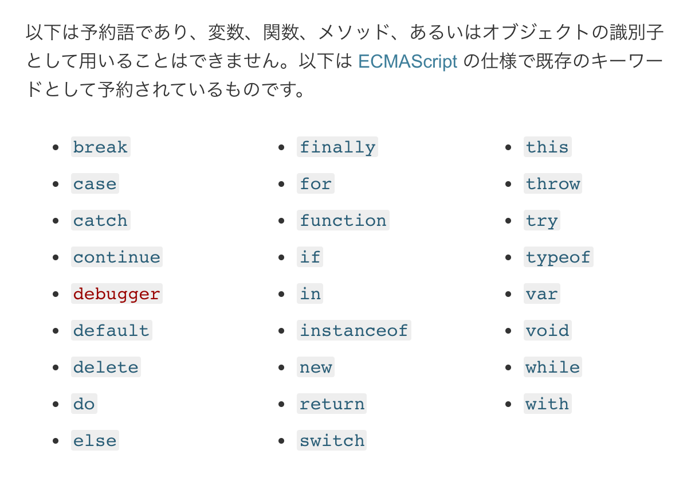
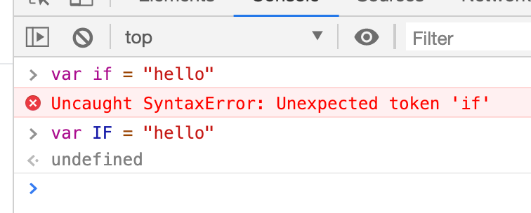

## 用語集

- 予約語
- keyword

## 予約語

プログラミング言語には「予約語(keyword)」と呼ばれるものがあります
**予約語はプログラム内で特別な意味を持ちます**。

JavaScriptの予約語一覧



詳しくはこちら！

https://developer.mozilla.org/ja/docs/Web/JavaScript/Reference/Reserved_Words

## 予約語は変数名や関数名として使用することはできません

大文字や小文字は区別されるため、大文字等で表記すれば使えますが、よほどのことがない限り避けた方が良いでしょう.

`if` は 変数として使えませんが `IF` 、 `If`、 `iF` などは変数として使えます。



## 変数や関数名のルールを思い出して下さい

**大文字と小文字は区別される**です

なので、

```js
null
Null
NULL
```

これらは全て別物で、**nullだけが予約語で特別な意味を持ちます**！

## 結論：大文字と小文字の違いに気をつけましょう！
