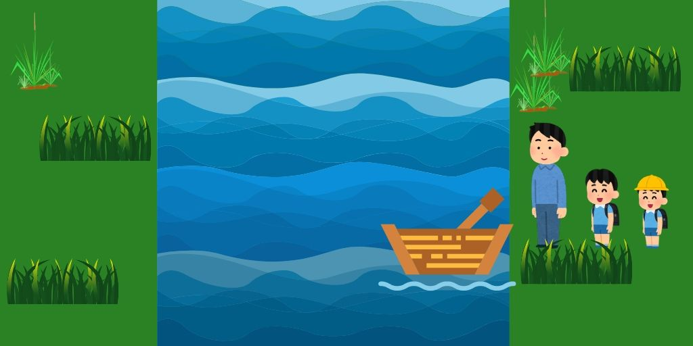

import Point from "/src/components/parts/point/index.js"
import Comment from "/src/components/parts/comment/index.js"
import Keyword from "/src/components/parts/keyword/index.js"
import Preparation from "/src/components/parts/preparation/index.js"

<Comment text="参加登録頂いたみなさん、初めまして！一ヶ月間、宜しくお願いします。" />

まずは頭の体操で、プログラミングに向いている脳を作っていきましょう。

下記の問題は、一見すると単なるクイズのように見えますが、このような手順を追って解く問題を「アルゴリズム問題」と呼びます。

この「アルゴリズム」を考える能力は、プログラミングする上で非常に重要なスキルのひとつなのです。

最終的に答えにたどりつけなくても、じっくり考えることでこういうったアルゴリズムを解くスキルが育っていくので、ぜひ頑張ってみてください！

2問目が短時間で解けたら、プログラミングの才能ありです！

<Point title="アルゴリズムとは？" text="アルゴリズム（英: algorithm）は、「計算可能」なことを計算する、形式的な手続きのこと。" />

## 問題1
> 大人一人と子供二人が、手漕ぎの船で対岸まで渡ろうとしています。船は小さく、子供であれば二人乗ることができますが、大人が一人乗るとそれで一杯になってしまいます。

> 船は一つしかなく、大人も子供も船が漕げるとした場合、どうやれば全員で対岸に渡ることが出来るでしょう？

> 

## 問題２
> ４人の人が真夜中に川にかかった吊り橋を渡ろうとしています。吊り橋に同時に乗ることが出来るのは最大二人です。

> それぞれの人の足の速さは大きく異なり、その橋を渡るにはそれぞれ１分、２分、５分、１０分が必要です。真っ暗なため、懐中電灯が必要ですが、一つしかないため、二人で渡る際には手を繋いで、遅い人に合わせたスピードで渡る必要があります。

> 懐中電灯の電池が１７分しか残っていない場合、どうやったら全員で対岸に渡ることが出来るでしょう？

--- 

いかがでしたか？

クイズの正解は[こちら](day00/answer)！

次回はこちら [JavaScript道場：1日目 / Chromeデベロッパー・ツールを使ってみよう](day01)
