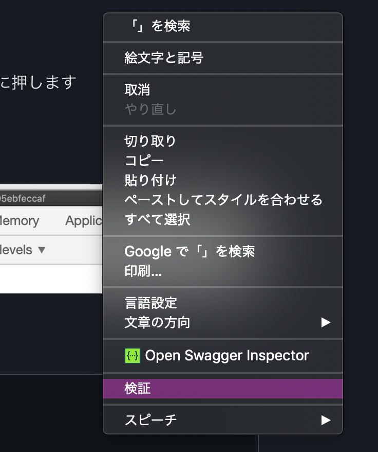
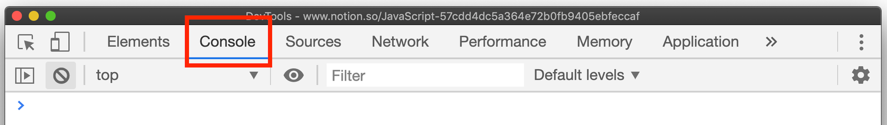
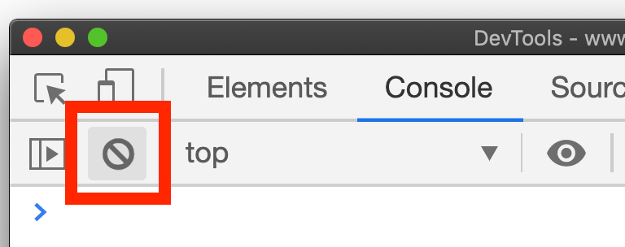
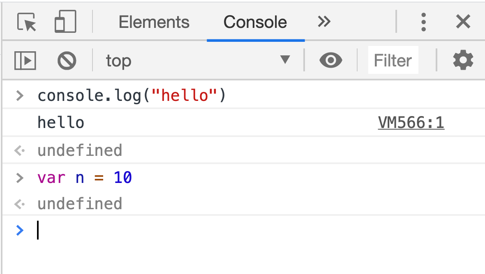

## 事前準備
[Chromeブラウザのインストール](https://www.google.co.jp/chrome/?brand=CHBD&gclid=Cj0KCQjwmdzzBRC7ARIsANdqRRk9k7pArul6ICEhB5oExKGUFKvHq9_5ifbzMOSPtLQGyh0YaZIYh1AaAq-GEALw_wcB&gclsrc=aw.ds)を済ませておいてください

## Chromeデベロッパー・ツールを使ってみよう

### デベロッパー・ツールとは？

- Webアプリのデバッグやパフォーマンスチューニングに役立つツール群
- JavaScriptを実行したり、通信の状況を確認したり、HTMLのレイアウトを確認したり、Webアプリ開発で役に立つ便利な機能が使えるもの
- Chromeブラウザに標準で搭載された機能(Chrome以外のブラウザにも似た機能を持つものもあります)

### コンソールでコードを書くメリット

ブラウザのコンソールは便利なので、使えるようにしておいてください。学習効率が違います。
JavaScriptの挙動を確かめたいだけであれば、コンソールで動かして確かめましょう。

**例示したコードは、必ず、自分の手で実行してください。**

× テキストエディタを立ち上げ→HTMLファイル新規作成→ブラウザで開く→実行結果確認  
○ consoleタブ開く→ コード打ち込む

## 早速実践！consoleタブでJavaScriptを実行してみよう
うまく行かない時は？
1. 別のタブを開いて試してみましょう
2. Webサイトによっては右クリックを「禁止」しているものもあります。違うウェブサイトへ遷移してみましょう

## 手順
### 1. 適当なウェブページを開く
どんなページでも構いません。
今閲覧している、このサイト上で実行するのが一番お手軽だと思います。

### 2. 右クリックして`検証` を選択

ショートカットキーもあります
- Macの場合、`command(⌘) + option(⌥) + i` 3つのキーを`同時`に押します
- windowsの場合、 `F12`



### 3. タブが複数あるので`Console` タブを選択します

### 4. コンソールタブでJavaScriptを実行してみよう！
変数宣言・関数・オブジェクトについては次回以降に詳しく解説します。まずは、コードを書いて動かしてみましょう。

```js
// 単純な計算
// + (加算)
// - (減算)
// / （除算）
// * (乗算)
// % (余り)
1 + 1
// 結果：2
3 - 1
// 結果：2
5 * 5
// 結果：25
10 / 2
// 結果：5
10 % 3
// 結果：1
```

---

```js
// 変数に数値を保存して計算
var num1 = 10
var num2 = 15
num1 * num2 // 150
```

---

```js
// ログ出力 文字の場合は｀引用符｀と呼ばれる記号で囲むこと
console.log("好きな文字")
```

---

```js
// 警告表示
alert("好きな文字")
```

---

```js
// 関数の登録
function hello(){
    console.log("HELLO WORLD!!")
}
// 関数の呼び出し
hello() // "HELLO WORLD!!"
```

---

```js
// JavaScriptオブジェクト
var obj = {
    name: "松田信介",
    age: 34,
    favorite_foods: ["バナナ", "りんご", "スイカ"]
}
obj.name // 松田信介
obj.age // 34
obj.favorite_foods[0] // バナナ
```

### 5. キーボードの上キー(↑)を押すと、直前に入力したプログラムを呼び出せます
以前に実行したプログラムを再度実行したいときに便利です
以前実行したプログラムを修正して再度実行することもできます

### 6. 🚫マークをクリックすると、コンソールの中身をクリアできます。
consoleを綺麗にしたい場合に使えます。
変数や関数などは登録されたままです。


**Consoleタブはめちゃくちゃ頻繁に使うので、必ず使い方を覚えてください。**

## プログラミングしている時のConsoleタブ使い方の一例

JavaScriptプログラミングをしている時、以下のような状況でConsoleタブを確認します

**1. 処理がどこまで進んだか確認する場合**
**2. 変数に今どのような値が入っているか確認する時**

下記のようなプログラムを書くと、コンソールに結果が表示されるため便利です。コンソールを使って効率的に開発を進めましょう。
こういったconsoleの使い方を「consoleデバッグ」と呼んだりします。
重要なテクニックなので、覚えておきましょう。

```js
var a = 100
a = a * 1.5
console.log("変数a:" + a) // 変数a:150
console.log({a}) // {a: 150}
a = "hello"
console.log({a}) // {a: "hello"}
```


## コンソールの見方
&gt;(左に開いた矢印)の行は、実行されるコード

```js
> a=10
```

&lt;(右に開いた矢印)の行は、returnされた結果(式が評価された結果)

```js
< 10
```

何もない行は、単にconsoleに出力された情報 (console.log で出力された文字など)


console.log の **戻り値**は **undefined**
var n = 10 の **戻り値**は **undefined**




二日目は、変数とは何か？なぜプログラミングには変数が必要か？変数の名前の付け方の解説をします
