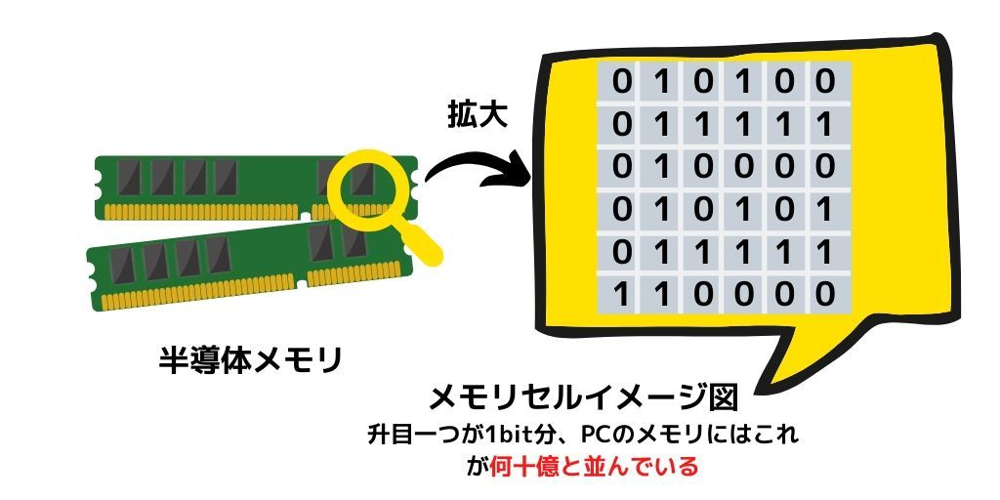
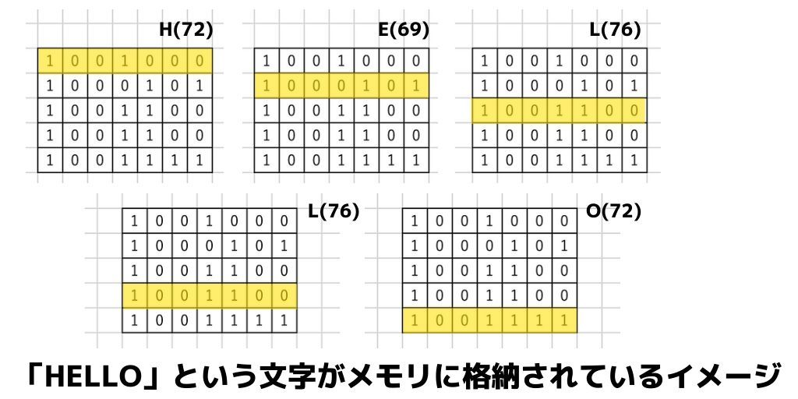

前回は if / 制御構文 をやりました。

前回: [​​​JavaScript道場：八日目 / 制御構文 if​](day08)

## 用語集
- 配列
- 四則演算
- for 繰り返し処理
- メモリ空間
- カウンタ変数

## 配列

複数の要素の集合を格納管理する**リスト構造**。変数は基本的に数値か文字か真偽値などのデータを一つしか保存できませんでしたが、**配列は複数の値を格納できます**。
オブジェクトは key:value 形式ですが、配列は順番(index)で要素を指定して取り出します。
​​配列データは**オブジェクト**(Arrayオブジェクト)なので、**プロパティ**を持っています。

### 配列はリスト構造

「順序付きのデータ」と考えてください。配列は複数のデータが「順番に」入ってるオブジェクトです。

### 配列とオブジェクトの違い

オブジェクトには`key`と`value`のペアでデータが入っていました。オブジェクトから特定の値を取り出したい場合はkeyを指定していました。

```js
// オブジェクトの場合
var obj = { name: "松田信介", age: 34 }
obj.name // 松田信介
obj.age // 34
```

配列は番号で指定します。
**配列の要素は0からカウント**します。

```js
// 配列の場合
var arr = [81, 22, 37, 40]
arr[0] // 0番目のデータ => 81
arr[1] // 1番目のデータ => 22
```

データに**名前をつけたい**ときは、オブジェクト
​​データの**順番**に注意を払う時は、配列

## MDNの資料を見ればよいので、覚える必要はありません

注：これから説明することは**暗記する必要はありません**。わからなければMDNを見ればよいです。**概念を理解することが一番重要です**。​​
​​これはプログラミングの学習全般に言えます。

- [MDN Array](https://developer.mozilla.org/ja/docs/Web/JavaScript/Reference/Global_Objects/Array)

# 配列の宣言

配列の宣言は、 `[]` でくくり、複数データがある場合はカンマで区切る

```js
var fruits = ["りんご", "バナナ"];
console.log(fruits.length);
```
    
配列の要素を取得する(index)  
index(添字)を使って、取り出すデータを指定することができます

```js
var fruits = ["りんご", "バナナ"];
var first = fruits[0];
var last = fruits[fruits.length - 1];
```

配列の長さを取得する(length)

> ## This is a header.
> 1. This is the first list item.
> 2. This is the second list item.
>
> Here's some example code:
>
>     ```js
>     console.log(fruits.length);
>     ```


> ### 配列に要素を追加する(push)
Here's some example code:
```js
fruits.push("みかん");
console.log(fruits)
// ["りんご", "バナナ", "みかん"]
```

> 配列の最後の要素を取り出す(pop)
```js
var arr = [1, 2, 3, 4, 5]
console.log(arr.pop()) // 5
arr // [1, 2, 3, 4]
```

> 配列の話は一旦これが最低限です。
```js
var num1 = 100
var num2 = 110
var num3 = 120
var num4 = 130
// 書き換え
var numbers = [100, 110, 120, 130, 140]
```

1. 配列を使うと複数の変数を宣言する必要がなくて、便利。
2. 順番が重要な同じ種類のデータをグループにしたい場合にも使える。

とだけ、まずは覚えておきましょう。

## 変数とメモリの話

変数は「データを格納する箱」という説明をしたと思いますが、これは正確な表現ではありません。
変数をちゃんと理解するには、**メモリ**について理解する必要があります。

## メモリとは

メモリは **ビットデータ(0 or 1)** を保持することができるコンピュータの部品です。主記憶装置(メインメモリ)と呼ばれます。
メモリが大きければ大きいほど効率よく作業できるので、よく作業机に例えられます。(机が広ければ沢山の本を開いたり文房具を置いたりできる)

## **メモリ空間**をイメージできるようになろう

**メモリ空間**(bitがコンピュータの中でどういう風に管理されているか)をイメージできなければ、必ずプログラミングの学習でつまづきます。
**逆にメモリが理解できれば、今後のプログラミング学習がグンと捗ります！**なので、メモリについてイメージを持っていただくたいと思ってこのコラムを差し込みました。

## メモリ空間をイメージできるようになると？

- デバッグしやすくなる
- 「オブジェクト」や「クラス」という概念をより深く理解できる
- 「newする」「インスタンスを作る」などが何を意味しているか理解できるようになる
- 効率の良いプログラムが書けるようになる

## 変数を宣言することで変数を使えるとは？

変数を宣言して値を格納した時、**変数は実際のところ、コンピュータのどこに保存されているでしょうか？**
答えは**メインメモリ(主記憶装置)**です。この部品は、スマホやPCなどには必ず入っています。


## 例えば変数`a`に`HELLO`という文字を格納した時

```js
var message = "HELLO" // 変数 messageを宣言しHELLOという文字列を格納
```

### 説明

→ コンピュータのメモリの一部に「message」という名前をつけ、そのメモリに「HELLO」というデータを格納した

### より詳しい説明

→ 文字が入るメモリ領域(8bit)を5つ確保し、先頭に「H」2番目に「E」3番目に「L」4番目に「L」5番目に「0」という文字を格納した。文字の配列(文字列)としてアクセスできるように「message」という名前をそのメモリ領域につけた。


```js
var message = "HELLO"
message[0] // H 配列は0からカウントする
message[1] // E
message[2] // L
message[3] // L
message[4] // O
```

## 文字列は「文字」の「配列」だった

```
"HELLO".length // 5
```

上記コード結果をみてわかる様に、文字を格納するデータ型があつまったものが「文字列」。
例えば「HELLO」がメモリに格納されているイメージが上記の画像です。(実際とは少し違いますが、こういう風にイメージしておいてください)

## for の書き方

```js
for (初期条件; 処理を続行する条件; 処理が終わった後に実行する) {
    繰り返し実行したい処理
}
```

```js
var message = "HELLO" // 配列オブジェクト
for (var n = 0; n < message.length; n++) {
    console.log(message[n])
}
```

### コードの解説

1. `for()` 繰り返しのキーワード
2. `var n = 0;` 変数 n を 初期値 0 で宣言
3. `n < message.length;`  変数 n が message.length より小さい時に、処理を続ける
4. `n++` 変数 n を 足す1 する。繰り返し処理が一回実行された後に実行される。
5. `console.log(message[n])` 変数 n が message.length より小さい時に実行される。


### 一行で書いてもOK

```js
for(var i=0;i<5;i++) { console.log(i) }
```

###  {} カッコの位置

改行してもしなくてもOK

```js
for(var i=0;i<5;i++) {
    console.log(i)
}
```

```js
for(var i=0;i<5;i++)
{
    console.log(i)
}
```

### keywordの周りのスペースはあってもなくも大丈夫

全て問題なく動作する

```js
for (var i=0;i<5;i++) {}
for(var i=0;i<5;i++){}
for( var i=0; i<5; i++ ) {}
```


### カウンタ変数

for のループが今何番目かをカウントするための変数のことです。
下記のコードでは `num` がカウンタ変数と呼ばれたりします。
普通の変数との違いは特にありません。forの中でカウンタとして使われる変数をそう呼ぶことがあるだけで、特別な変数ではありません。

```js
for(var num = 0; num < 5; num++){
    // statement
}
```

下記を読んで不明な単語があれば質問してくださいね！
- [MDN for](https://developer.mozilla.org/ja/docs/Web/JavaScript/Reference/Statements/for)

---

次回はこちら [JavaScript道場：10日目 / DOM操作 その❶](day10)

