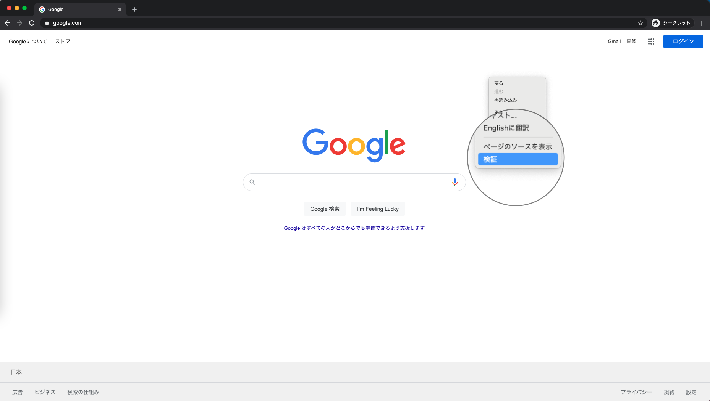
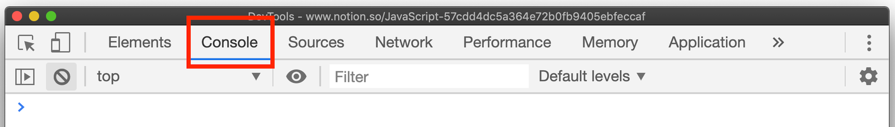
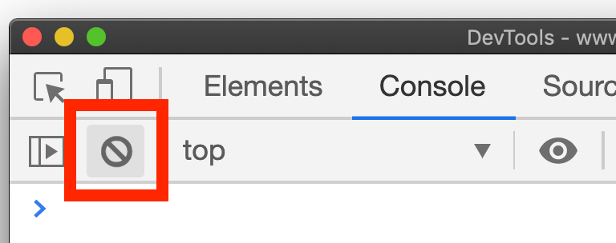
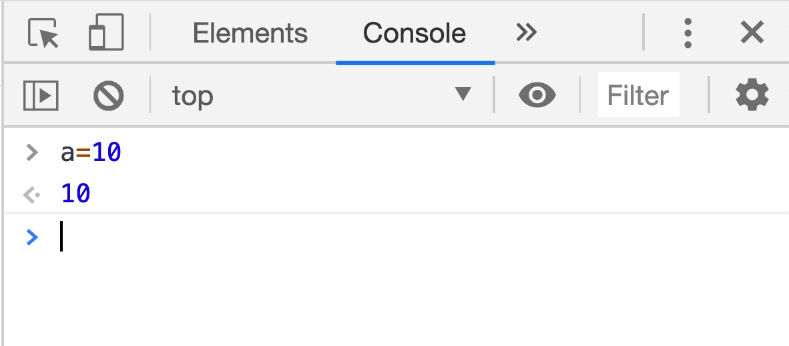
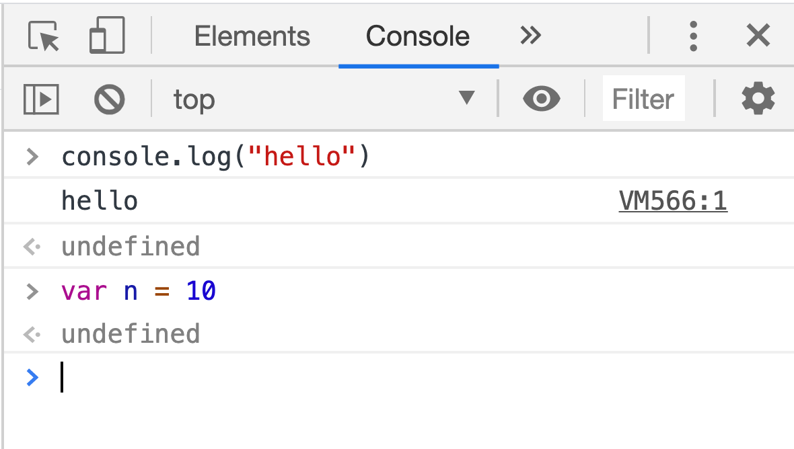

import Point from "/src/components/parts/point/index.js"
import Comment from "/src/components/parts/comment/index.js"
import Keyword from "/src/components/parts/keyword/index.js"
import Quote from "/src/components/parts/quote/index.js"

## このページで学ぶこと

- デベロッパー・ツールの使い方
- コンソールの使い方

## 学ぶ理由

## 事前準備
Chromeブラウザのインストールを使って説明をしていきます。Chromeブラウザがない場合は、インストールを事前に行ってください。

- [Chromeブラウザをインストールする](https://www.google.co.jp/chrome/?brand=CHBD&gclid=Cj0KCQjwmdzzBRC7ARIsANdqRRk9k7pArul6ICEhB5oExKGUFKvHq9_5ifbzMOSPtLQGyh0YaZIYh1AaAq-GEALw_wcB&gclsrc=aw.ds)

Chromeブラウザ以外にもデベロッパー・ツールを使えるブラウザがあります。
使い慣れたブラウザでデベロッパー・ツールを使える場合は、そちらを使っても問題ありません。

## Chromeデベロッパー・ツールを使ってみよう

### デベロッパー・ツールとは？
Webアプリのデバッグやパフォーマンスチューニングに役立つツール群のことです。

JavaScriptを実行したり、通信の状況を確認したり、HTMLのレイアウトを確認したりといったWebアプリ開発で役に立つ便利な機能が使うことができます。

Chromeブラウザに標準で搭載された機能(Chrome以外のブラウザにも似た機能を持つものもあります)です。

<Quote text="Webアプリのデバッグやパフォーマンスチューニングに役立つツール群 JavaScriptを実行したり、通信の状況を確認したり、HTMLのレイアウトを確認したりといったWebアプリ開発で役に立つ便利な機能が使えるもの Chromeブラウザに標準で搭載された機能(Chrome以外のブラウザにも似た機能を持つものもあります)です" />

### コンソールでコードを書くメリット

ブラウザのコンソールはとても便利なので、いつでも使えるように使い方の練習をしておきましょう。  

コンソールを使って勉強すると、学習効率が格段に違います。  
JavaScriptの挙動を確かめたい場合は、コンソールで動かして確かめましょう。

そして、**例示したコードは、必ず、自分の手で実行してください。**

#### 推奨しない方法
- テキストエディタを立ち上げ
- HTMLファイル新規作成
- ブラウザで開く
- 実行結果確認  

#### 推奨する方法
- consoleタブを開く
- コード打ち込む

それでは、一緒に練習していきましょう。

---

## 実践！consoleタブでJavaScriptを実行してみよう

<Point title="コードがうまく実行されない時は？" text="1. 別のタブを開いて試してみましょう 2. ブラウザをリロードしてみましょう
3. Webサイトによっては右クリックを「禁止」しているものもあります。違うウェブサイトへ遷移してみましょう
"/>

<Comment title="コードがうまく実行されない時は？" text="かえるぴょこぴょこみぴょこぴょこ
    あわせてぴょこぴょこむぴょこぴょこ"/>

## consoleタブを表示する手順
### 1. 適当なウェブページを開く
どんなページでも構いません。
今閲覧している、このサイト(JavaScript道場)のコンソールで実行するのが一番お手軽だと思います。

### 2. 右クリックして「検証」を選択
ショートカットキーもあります
- Macの場合、`command(⌘) + option(⌥) + i` 3つのキーを`同時`に押します
- windowsの場合、 `F12` を押します

> 

### 3. タブが複数あるので Console タブを選択します



### 4. コンソールタブでJavaScriptを実行してみよう！
変数宣言・関数・オブジェクトについては次回以降に詳しく解説します。  
まずは、コードを実際に書いて動かしてみましょう。

```js
// + (加算)
1 + 1
```

```js
// - (減算)
3 - 1
```

```js
// / （除算）
10 / 2
```

```js
// * (乗算)
5 * 5
```

```js
// % (余りの計算)
10 % 3
```

```js
// 変数に数値を保存して計算
var num1 = 10
var num2 = 15
num1 * num2
```

```js
// ログ出力 文字の場合は｀引用符｀と呼ばれる記号で囲むこと
console.log("好きな文字")
```

```js
// 警告表示
alert("好きな文字")
```

```js
// 関数の登録
function hello(){
    console.log("HELLO WORLD!!")
}
// 関数の呼び出し
hello()
```
  
```js
// JavaScriptオブジェクト
var obj = {
    name: "松田信介",
    age: 34,
    favorite_foods: ["バナナ", "りんご", "スイカ"]
}
obj.name
obj.age
obj.favorite_foods[0]
```

### 5. キーボードの上キー(↑)を押すと、直前に入力したプログラムを呼び出せます
以前に実行したプログラムを再度実行したいときに便利です。  
以前実行したプログラムを修正して実行することもできます。

### 6. 🚫マークをクリックすると、コンソールの中身をクリアできます。
consoleに出力されたlogを削除し、綺麗にしたい場合に使えます。  
変数や関数などは登録されたままです。

> 

**Consoleタブはめちゃくちゃ頻繁に使うので、必ず使い方を覚えるようにしてください。**

## プログラミングしている時のConsoleタブ使い方の一例

JavaScriptプログラミングをしている時、以下のような状況でConsoleタブを確認します

**1. 処理がどこまで進んだか確認する場合**  
**2. 変数に今どのような値が入っているか確認する時**

下記のように `console.log()` というメソッドを使いながらプログラムを書くと、コンソールに結果(ログ)が表示されるため動作を確認する際に便利です。  

コンソールを使って効率的に開発を進めましょう。こういったconsoleの使い方を「consoleデバッグ」と呼んだりします。重要なテクニックなので、覚えておきましょう。

<Keyword title="大事なポイント: consoleデバッグ" text="consoleにデータを表示させて、プログラムの動作を確認しながらコードを書くこと。処理の流れが追いやすくしたり、変数にどんなデータが入っているかを確認しやすくできる。" />

```js
var a = 100
a = a * 1.5
console.log("変数a:" + a) // 変数a:150
console.log({a}) // {a: 150}
a = "hello"
console.log({a}) // {a: "hello"}
```

しっかり理解して使いこなしてください。

## コンソールの見方
&gt; (左に開いた矢印)の行は、実行されるコード

> ```js noLineNumbers
> > a=10
```

&lt; (右に開いた矢印)の行は、returnされた結果(式が評価された結果)

> ```js noLineNumbers
> < 10
```

何もない行は、単にconsoleに出力された情報 (console.log で出力された文字など)

> 

console.log の **戻り値**は **undefined**  
var n = 10 の **戻り値**は **undefined**

> 

---

二日目は、変数とは何か？なぜプログラミングには変数が必要か？そして、変数の名前の付け方の解説をします

次回はこちら [JavaScript道場：2日目 / 変数について](day02)
