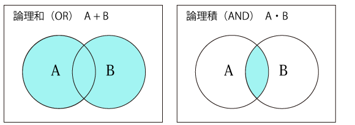

今日は制御構文についてやります。

前回はこちら
[+JavaScript道場：七日目 / 関数について❷](day07)

## 用語集
- if / 条件分岐
- 条件は真偽値`true`または`false`として判定される
- `==`と`===`の違い
- 比較演算子

制御構文で最低限覚えて置くことは`if`と`for`の書き方です。今日は `if` をやります。

## 比較演算子
文字や数字、オブジェクトが一致するかを比較し`true`または`false`の真偽値を返します。

詳しくはこちら！
- [MDN 比較演算子](https://developer.mozilla.org/ja/docs/Web/JavaScript/Reference/Operators/Comparison_Operators)

### `==` (一致)

可能な限り === を使いましょう

```js
// consoleで試そう
　　
// 一致するか比較する
100 == 100 // true
100 == '100' // true
"文字" == "文字" // true
　　
// ()で括ってもOK
(100 == 100) // true
(100 == '100') // true
("文字" == "文字") // true
　　　　　　　
var a = "hello"
var b = "hello"
var c = "helloo" // oが多い
　　　
a == b // true
a == c // false
```

### `===` (データ型まで一致、厳密な比較)

```js
// consoleで試そう
　
// 一致するか比較する
100 === 100 // true
100 === '100' // false 文字と数値ではデータ型が異なる
```

## オブジェクトの比較
オブジェクトは中身のデータが一緒でも、参照するオブジェクトが一緒じゃない場合 false になります。ここは重要なので覚えておいてください。

```js
var a = {}
var b = {}
　
a == b // false
　
var c = a
a == c // true
```

```js
// 試してみよう
var a = {}
var b = a // a と b は同じ
　　
a.name = "JavaScript道場"
console.log(a)
console.log(b)
console.log(a === b)
```

### `<`・`>`・`<=`・`=>` (大小比較)

```js
// consoleで試そう
　　
var a = 100
a > 100  // aは100より大きい false
a <= 100 // aは100以下 true
a >= 99  // aは９９以上 true
a < 99   // aは９９より小さい false
```

## `if`

条件に応じて実行する処理を変えたい場合に使います。

詳しくはこちら！
- [MDN if...else](https://developer.mozilla.org/ja/docs/Web/JavaScript/Reference/Statements/if...else)

```js
if (条件式) { 条件を満たす時に実行する処理 }
　　
// サンプルプログラム  　
// a の値を変化させて実行結果を確認しよう
var a = 100
if (a > 100) {
    console.log("aは100より大きい")
}
```

一行で書くこともできます

```js
// {} が省略できます
if (a > 100) console.log("aは100より大きい")
```

## `if` ~ `else`

```js
var a = 100
if (a > 100) {
    console.log("aは100より大きい")
} else {
    console.log("aは100以下")
}
```

## `if` ~ `else if` ~ `else`
```js
var a = 100
if (a > 100) {
    console.log("aは100より大きい") // 実行されない
} else if (a < 50) {
    console.log("aは50以下") // 実行されない
} else {
    console.log("aは50~100の間") // 実行される
}
```

## 条件は複数指定できる

### `&&` と `||`

```js
var a = true
var b = true
var c = false
　　
if (a && b) {
    // a も b も true
}
　　
if (a || b) {
    // a または b どちらかが true
}
```

### 複数条件指定するときは、`( )`を使ってわかりやすく書く
```js
if (a || b && c) {
    // a が true または b,c どちらかも true
}
　　
if ((a || b) && c) {
    // c が true
    // a または b どちらかが true
    console.log("hello")
}
```




## 真偽値以外のもの(数値や文字)が if で使われた場合の挙動

正確な情報はこちら！

- [Truthy](https://developer.mozilla.org/ja/docs/Glossary/Truthy)


### 数値の場合

JavaScriptの場合、数値が0以外は全て`true`、0のみ`false`です

```js
var a = 100;
if(a) {
    console.log("aはtrue?")
} else {
    console.log("aはfalse?")
}
```

### 文字の場合

`""` 空文字の場合`false`、それ以外は `true`

```js
var a = "hello";
if(a) {
    console.log("aはtrue.")
} else {
    console.log("aはfalse.")
}
// aはtrue.
```

```js
var a = "";
if(a) {
    console.log("aはtrue.")
} else {
    console.log("aはfalse.")
}
// aはfalse.
```

### ルールが明確に決まっています.

JavaScript (ECMA-262)
false（偽）になるものは下記のみ。

```js
false
undefined
null
+0,-0,NaN
"" （空文字）
```


## 良い設計のためのヒント

### 真偽値判定が複雑になる場合は真偽値を返す関数を作る

材料からカレーが作れるかを判定する

```js
var materials1 = [
    { name: "じゃがいも", quantity: 2 },
    { name: "人参", quantity: 3 },
    { name: "牛肉", quantity: 100 },
    { name: "ブロッコリー", quantity: 1 },
    { name: "カレーのルウ", quantity: 1 },
];
　
var materials2 = [
    { name: "じゃがいも", quantity: 2 },
    { name: "人参", quantity: 1 },
    { name: "牛肉", quantity: 100 },
    { name: "ブロッコリー", quantity: 1 },
    { name: "カレーのルウ", quantity: 1 },
];
　
// 必要な材料が必要な個数あるかを判定する
function canCookCurry (materials) {
    const REQ_POTATO = 2
    const REQ_CARROT = 3
    const REQ_BEEF = 100
    const REQ_ROUX = 1
    if(materials.filter((_) => _.name == "じゃがいも"  && _.quantity >= REQ_POTATO) == 0){
    return false;
    }
    if(materials.filter((_) => _.name == "人参"  && _.quantity >= REQ_CARROT) == 0){
    return false;
    }
    if(materials.filter((_) => _.name == "牛肉"  && _.quantity >= 100) == 0){
    return false;
    }
    if(materials.filter((_) => _.name == "カレーのルウ"  && _.quantity >= REQ_ROUX) == 0){
    return false;
    }
    return true;
}
console.log(canCookCurry(materials1)); // true
console.log(canCookCurry(materials2)); // false
```

---

明日は for をやります

次回はこちら [JavaScript道場：9日目 / 配列と制御構文 for](day09)
