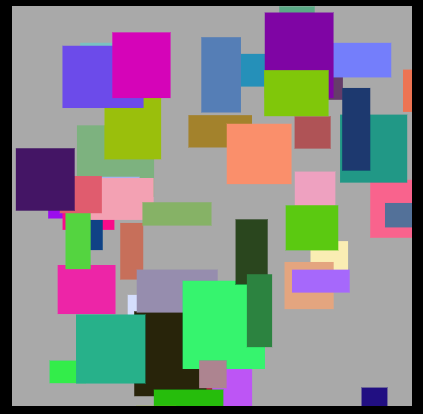

##  前回の続き・・・

前回は多めに課題を出しましたが、いかがでしたか？
[+JavaScript道場：十二日目 / DOM操作 その❸](day12)

##  課題の解説
###  toString(16) とは？
10進数で表現された数字を16進数に変換する関数。数値型(Number型)の変数の時に使えるメソッドです。

```js
var num1 = 165;
console.log(num1.toString(16)) // a5
　　
var num2 = 235;
console.log(num2.toString(16)) // eb
```

###  Math.floor とは？
引数として与えた数以下の最大の整数を返します。(小数を整数に変換する)
詳しくは MDN で Math.floorの項目を見ましょう。

```js
console.log(Math.floor(1.123413)) // 1
console.log(Math.floor(33.123413)) // 33
```

###  Math.random とは？
0 以上 1 未満の疑似乱数を返す。
詳しくは MDN で Math.randomの項目を見ましょう。

```js
Math.random() // 0~1未満の乱数が返る
256*Math.random() // 0~256未満の乱数が返る
```

###  注意

<p class="headline red--text text--darken-1 font-weight-bold">
    これらを暗記しようと考えないでください。MDNに全て使い方は書いてあります。
    ベテランのエンジニアでも調べながら書くのが普通です。
</p>

<p class="headline red--text text--darken-1 font-weight-bold">
    これらを暗記しようと考えないでください。MDNに全て使い方は書いてあります。
    ベテランのエンジニアでも調べながら書くのが普通です。
</p>

**大事なことなので二回言いました。**

##  forを使ってたくさん四角形を書いてみよう

```js
// 前回作成したHTMLで実行すること！！
// コンソールで実行してみよう
var canvas = document.getElementById('canvas')
var ctx = canvas.getContext('2d')
　
for(var i=0; i < 50; i++) {
    // 50回繰り返す
    ctx.fillStyle = randomColorCode() // 色を指定する
    ctx.fillRect(
        Math.random()*400,
        Math.random()*400,
        Math.random()*70 + 20, // 最低20以上のサイズにするため + 20
        Math.random()*70 + 20  // 最低20以上のサイズにするため + 20
    )
}
　
// #000000 ~ #ffffff までの色コードを返す関数
function randomColorCode() {
    var randomColor = "#"
    for(var i = 0; i < 6; i++) {
        randomColor += Math.floor(16*Math.random()).toString(16)
    }
    return randomColor
}
```

###  実際に生成された画像
注意：ランダムなので、実行するたびに色や大きさは異なります


##  setIntervalを使って一定間隔で四角形を沢山書く関数を実行しよう

```js
// 前回作成したHTMLで実行すること！！
// コンソールで実行してみよう
// 自分なりに書き換えてみよう
var canvas = document.getElementById('canvas')
var ctx = canvas.getContext('2d')
　
// setInterval(callback, intervalTime)
setInterval(() => {
    // 50回繰り返す
    for(var i = 0; i < 50; i++) {
        // 色を指定する
        ctx.fillStyle = randomColorCode()
        // 引数が長い場合、改行してもOK
        ctx.fillRect(
            Math.random()*400,
            Math.random()*400,
            Math.random()*70 + 20, // 最低20以上のサイズにするため + 20
            Math.random()*70 + 20  // 最低20以上のサイズにするため + 20
        )
    }
}, 200)
　
// #000000 ~ #ffffff までの色コードを返す関数
// これ以外にも色々な書き方考えられます
function randomColorCode() {
    var randomColor = "#"
    for(var i = 0; i < 6; i++) {
        randomColor += Math.floor(16*Math.random()).toString(16)
    }
    return randomColor
}
```


##  無名関数
###  無名関数と呼ばれる物があります。名前がついていない関数のことです。
アロー関数は無名関数の一種です。（無名関数の省略記法）
callback関数を定義する時によく使われます。

```js
// 無名関数の書き方 () は引数、 {} に処理
　
// ① (引数, ...) => { 処理 }
() => {}
　
// ② 引数があるとき
(message) => { console.log(message) } // return なし
(num) => { return nun * num } // return ありの場合
　
// ③ 無名関数を変数に格納
var func = (num) => { return nun * num }
func(100)
　
// ④ 即時実行
((num) => { return num * num })(100)
```

###  下記の2パターンは同じ結果になるはずです。試して見ましょう。

- **パターン1**

```js
function sayHello(message) {
    console.log(message)
}
　　
setInterval( sayHello , 200, "hello" )
```

- **パターン2**

```js
setInterval( () => { console.log("hello") }, 200 )
```

##  Canvasの使い方紹介

もっとCanvasを使いこなしたい方は下記を参照してください
- [canvas intro](https://www.w3schools.com/graphics/canvas_intro.asp)

ここまでが前回の内容の確認でした。for / setInterval / 関数 の復習になりましたか？

**難しそうに見えるプログラミングも、基本的には「変数に値を保持する」「オブジェクトを作成する」「関数を定義する」「関数を実行する」「配列を操作する」「文字列を結合する」「四則演算」「繰り返し」「条件分岐」「DOMの操作」この基本的な事柄の組み合わせでしかありません。**

**プログラミングの90%以上はこれです。まずこの基礎を完全に使いこなせるようになってください。**
引き続きDOMについて見ていきます。

##  課題
1. 円を書いてみよう
2. 円を`移動`させてみよう

じっくり考えて見てください。

##  DOM操作の概要 / 何ができるのか？
DOMを使用すると、JavaScriptは動的にHTMLを作成するために必要な **すべての要素を取得** できます。

- JavaScriptは、ページ内のすべてのHTML要素を変更することができます
- JavaScriptは、ページ内のすべてのHTML属性を変更することができます
- JavaScriptは、ページ内のすべてのCSSスタイルを変更することができます
- JavaScriptは、既存のHTML要素と属性を削除することができます
- JavaScriptは、新しいHTML要素や属性を追加することができます
- JavaScriptは、ページ内のすべての既存のHTMLイベントに反応することができます
- JavaScriptは、ページ内の新しいHTMLイベントを作成することができます

```js
<html>
    <body>
　　
    　<p id="demo"></p>
    　<p id="sample"></p>
    　　
    　<script>
    　　
    　 // id が demo の要素
    　 document.getElementById("demo").innerHTML = "Hello World!";
    　　
    　 // id が sample の要素
    　 var dom = document.getElementById("sample")
    　　
    　</script>
    　　
　</body>
</html>
```

##  次回予告 - イベントハンドラについて -
クリックを検知して何かをしたい時は、**onclick属性**を使用します。

####  onclickのサンプルコード

```js
<html>
    <body>
    <button onclick="func()">ボタン Click me!</button>
    　
    <script>
        function func() {
            // ボタンをクリックすると、ここに書いた処理が実行される
            alert("funcが実行されました")
        }
    </script>
    　
    </body>
</html>
```

---

次回、イベントについて
- [MDN イベントリファレンス](https://developer.mozilla.org/ja/docs/Web/Events)

次回はこちら [JavaScript道場：14日目 / DOM操作 その⑤](day14)
